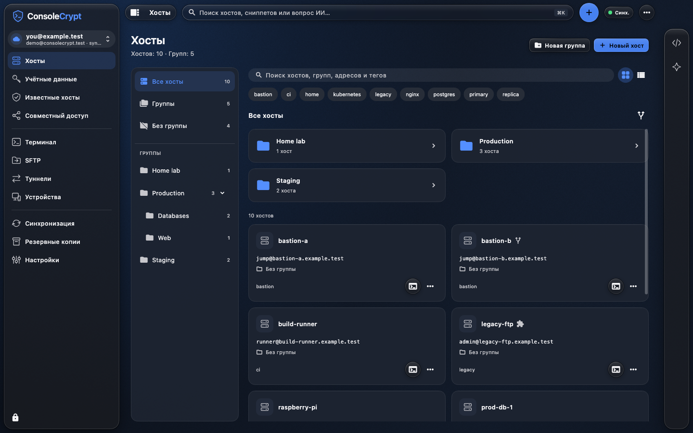

**English** | [Русский](README.ru.md)

<p align="center"></p>

# ConsoleCrypt — clients

An open-source application for working with servers: SSH, RDP, SFTP, an encrypted
vault for connections and credentials, and collaboration. Work locally, connect
your own sync server, or use the public ConsoleCrypt server.

[Download 0.3.1](https://github.com/evsikovas/consolecrypt-client/releases/tag/v0.3.1) ·
[User guide](https://github.com/evsikovas/consolecrypt-docs/blob/main/guide/en.md) ·
[Website](https://consolecrypt.evsikov.net/?lang=en) ·
[Server and protocol](https://github.com/evsikovas/consolecrypt-server)



*Hosts and groups in ConsoleCrypt. The screenshot uses demonstration data.*

## Features

- **SSH:** multiple terminal tabs, password and key authentication, host key
  verification, jump hosts, tunnels, and terminal history. Connections go directly
  from your device to the target host.
- **RDP:** Windows remote desktops through IronRDP, parallel session tabs,
  full-screen mode, text clipboard sharing, and redirection of a selected folder
  with separate write permission. Works with a standard Microsoft RDP server;
  you do not need to install IronRDP on the remote Windows machine.
- **Hosts and groups:** saved SSH/RDP connections, credentials, search by name
  or address, and a host picker accessible from the global “+” button.
- **SFTP:** file transfer and preview, editing in an external desktop application,
  and a configurable default editor.
- **Snippets:** save commands, organize collections, search, edit, and sync them.
- **AI:** explain selected output and errors, and prepare commands. Choose a
  compatible provider, including local models. Actions require confirmation;
  the AI subsystem has no access to the secrets vault.
- **Protected workspace:** an encrypted vault, separate profiles, locking,
  recovery, and encrypted backups.
- **Synchronization:** encrypted data shared between trusted devices;
  the server cannot decrypt vault contents.
- **Selective sharing:** selected SSH connections, groups, secrets, and snippets,
  with recipient device verification and access management. The chosen server
  must support the corresponding features. Revoking access does not erase copies
  the recipient has already saved.
- **Interface:** light and dark themes, accent colors, terminal palettes,
  side panels, and Russian and English translations.

## Platforms and installation

| Platform | Package | Status |
|---|---|---|
| macOS Intel / Apple Silicon | Universal DMG | Move the application to Applications |
| Windows x64 | EXE / portable ZIP | Run the installer or extract the ZIP |
| Linux x64 | DEB / RPM | Requires a graphical session and an unlocked persistent Secret Service keyring |
| Android ARM64 | APK | Mobile preview, Android 11+ |
| iOS | Universal Simulator ZIP | Preview for Xcode Simulator; not an iPhone installer |

Compare the downloaded file's SHA-256 with `SHA256SUMS-0.3.1.txt` in the release.
Install Linux packages with `sudo apt install ./package.deb` or
`sudo dnf install ./package.rpm`. See the guides below for detailed requirements.
Mobile operating systems restrict background activity; external desktop editors
and RDP folder redirection are unavailable on Android/iOS.
RDP has been tested on macOS and Windows with Windows Server. A Simulator build
does not establish compatibility with a physical iPhone.

RDP supports up to four sessions. The clipboard transfers text up to 64 KiB,
without images or files. Selected-folder transfers support files up to 256 MiB,
with a 512 MiB limit on attempted writes per session. Sharing saved RDP hosts
with other users is not yet supported. To sync RDP hosts, update every device
using the vault to version 0.3 or later.

## Getting started

1. Choose a local profile or connect to a sync server.
2. Create a vault and store the recovery key somewhere safe.
3. In Hosts, add an SSH or RDP connection and fill in the relevant fields.
4. Verify the remote server's identity and connect.
5. If needed, allow RDP clipboard sharing or select a specific shared folder.

SSH/RDP/SFTP traffic does not pass through the sync server. The server handles
accounts and encrypted data, but it can see email addresses and operational
metadata. Do not include secrets in text you choose to send to an AI provider.

## Source layout

- `client/flutter/` — shared Flutter interface and platform integrations.
- `client/rust/` — cryptography, storage, sync, SSH/RDP/SFTP, AI, and FFI.
- `crates/models/` — data models used inside the encrypted vault.
- `client/scripts/` — build, packaging, and package verification scripts.
- `docs/public/` — build, release, and troubleshooting guides.

The wire protocol is maintained in the server repository. The client's current
`main` branch pins `cc-protocol` to a specific Git commit; fetching it does not
require building the server application. Historical tags include their matching
protocol copy so published release sources remain self-contained.

## Building

Install Rust through rustup (the version is pinned in `rust-toolchain.toml`),
Flutter, and the native tools for your platform. Exact SDK versions and additional
dependencies are listed in [BUILDING.md](docs/public/BUILDING.md).
The detailed platform build guides are currently in Russian.

```sh
git clone https://github.com/evsikovas/consolecrypt-client.git
cd consolecrypt-client
cd client/flutter
flutter pub get
cd ../..
```

| Platform | Command from the repository root | Guide |
|---|---|---|
| macOS | `bash client/scripts/build-macos.sh --no-cli` | [Building](docs/public/BUILDING.md) |
| Windows | `powershell -File client/scripts/build-windows.ps1` | [Windows](docs/public/BUILD_WINDOWS.md) |
| Linux | `bash client/scripts/build-linux.sh` | [Linux](docs/public/BUILD_LINUX.md) |
| Android | `bash client/scripts/build-android.sh` | [Android](docs/public/BUILDING.md#android--arm64) |
| iOS Simulator | `bash client/scripts/build-ios.sh` | [iOS](docs/public/BUILD_IOS.md) |

Build outputs are placed in `dist/`. macOS/iOS builds require a Mac with Xcode;
Windows builds require MSVC and the Windows SDK. Private signing keys and local
configuration are not included in Git. An APK built with a different Android key
cannot update the installed application in place. Preserve signing identities
and maintain increasing build numbers when preparing updates.

## Testing

```sh
cargo test --locked --manifest-path crates/Cargo.toml
cargo test --locked --manifest-path client/rust/Cargo.toml
cd client/flutter
flutter pub get
flutter analyze
flutter test
```

Tests that need a native library, a system keyring, or a real SSH/RDP server have
additional prerequisites. Do not run Flutter tests alongside a native build
in the same working directory.

## Release 0.3.1 and the GitHub migration

Version 0.3.1 fixes page spacing and SSH/RDP host selection; see the
[release notes](docs/public/RELEASE_0_3_1.md). Known limitation: changing a shared
folder or its permissions during an RDP session can sometimes disconnect it.
Save your remote work before making changes and reconnect if necessary.

The GitHub release contains copies of the existing installers, without rebuilding
them. Production builds, the website, the server, and update delivery remain on
GitLab and the existing infrastructure for now. GitHub Actions is not enabled.
See [MIGRATION.md](MIGRATION.md).

## License and issue reporting

Current first-party code is licensed under [AGPL-3.0-only](LICENSE). Third-party
components retain their own licenses and notices; historical releases retain
their original terms. Author: Alexander Evsikov. Report vulnerabilities as
described in [SECURITY.md](SECURITY.md), and other reproducible problems through
Issues. Do not attach passwords, private keys, tokens, or real vault contents.
